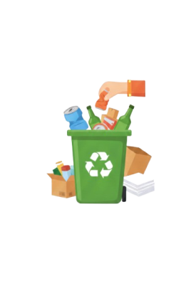

# 🔐 Panduan Autentikasi RePoint

## Overview

Fitur autentikasi RePoint terdiri dari dua halaman utama:

1. **Login Page** - Untuk pengguna yang sudah terdaftar
2. **Registration Page** - Untuk pengguna baru

## Struktur File

```
lib/features/auth/
├── login_page.dart          # Halaman login
└── registration_page.dart   # Halaman registrasi
```

## Cara Menggunakan

### Menjalankan Aplikasi dengan Autentikasi

```bash
# Run dengan autentikasi
flutter run lib/main_with_auth.dart

# Atau set sebagai default
# 1. Backup main.dart lama
mv lib/main.dart lib/main_no_auth.dart

# 2. Copy main_with_auth.dart ke main.dart
cp lib/main_with_auth.dart lib/main.dart

# 3. Run normal
flutter run
```

### Menjalankan Aplikasi Langsung ke Home (Skip Login)

```bash
# Run tanpa autentikasi
flutter run lib/main.dart
```

## Fitur Login Page

### UI Components

- Logo RePoints (asset/logo_utama.png)
- Ilustrasi kampus (asset/sampah.png)
- Form login:
  - Email Kampus (TextFormField)
  - Kata Sandi (TextFormField dengan toggle visibility)
- Link "Lupa Kata Sandi?"
- Button "Masuk (Login)"
- Link navigasi ke Registration Page

### Validasi

- ✅ Email tidak boleh kosong
- ✅ Email harus mengandung '@'
- ✅ Password tidak boleh kosong

### Flow

1. User membuka aplikasi → Login Page
2. User input email & password
3. Klik "Masuk (Login)"
4. Validasi form
5. Navigate ke RePointShell (Home)

### Fitur Tambahan

- **Lupa Kata Sandi**: Menampilkan dialog instruksi kontak admin
- **Link ke Registrasi**: "Belum punya akun? Daftar disini"

## Fitur Registration Page

### UI Components

- Logo RePoints (asset/logo_utama.png)
- Form registrasi:
  - Nama Pengguna (TextFormField)
  - Email (TextFormField)
  - Jurusan (DropdownButtonFormField)
  - Kata Sandi (TextFormField dengan toggle visibility)
  - Konfirmasi Kata Sandi (TextFormField dengan toggle visibility)
  - No. Telp (TextFormField)
- Button "Daftar Akun RePoints"
- Link navigasi ke Login Page

### Pilihan Jurusan

```dart
- Teknik Informatika
- Teknik Elektro
- Teknik Sipil
- Teknik Mesin
- Teknik Lingkungan
- Teknik Industri
- Sistem Informasi
- Arsitektur
```

### Validasi

- ✅ Nama tidak boleh kosong
- ✅ Email tidak boleh kosong & harus valid (mengandung @)
- ✅ Jurusan harus dipilih
- ✅ Password tidak boleh kosong & minimal 8 karakter
- ✅ Konfirmasi password harus sama dengan password
- ✅ Nomor telepon tidak boleh kosong & minimal 10 digit

### Flow

1. User membuka Registration Page
2. User mengisi semua field
3. Klik "Daftar Akun RePoints"
4. Validasi form
5. Success message
6. Navigate ke Login Page

### Fitur Tambahan

- **Link ke Login**: "Sudah punya akun? Masuk (Login) disini"
- **Helper Text**: Contoh input untuk setiap field
- **Password Toggle**: Show/hide password dengan icon

## Design System

### Colors

```dart
Background: Color(0xFFE8F5E9)  // Light green
Card: Colors.white
Button: Color(0xFFA5B68D)      // Muted green
Primary: Color(0xFF4CAF50)     // RePoint green
Border: Colors.grey.shade300
```

### Typography

- Title: 24-28px, Bold, Primary Green
- Body: 14-16px, Regular
- Helper Text: 12px, Grey

### Spacing

- Card Padding: 24px
- Field Spacing: 16px
- Border Radius: 12px (fields), 24px (cards)

## Integrasi Backend (TODO)

Saat ini autentikasi hanya UI/UX. Untuk integrasi backend:

### Login

```dart
Future<void> _login() async {
  if (_formKey.currentState!.validate()) {
    try {
      // TODO: Call API login
      final response = await AuthService.login(
        email: _emailController.text,
        password: _passwordController.text,
      );

      if (response.success) {
        // Save token
        await SecureStorage.saveToken(response.token);

        // Navigate to home
        Navigator.of(context).pushReplacement(
          MaterialPageRoute(builder: (context) => const RePointShell()),
        );
      }
    } catch (e) {
      // Show error
      ScaffoldMessenger.of(context).showSnackBar(
        SnackBar(content: Text('Login gagal: $e')),
      );
    }
  }
}
```

### Registration

```dart
Future<void> _register() async {
  if (_formKey.currentState!.validate()) {
    try {
      // TODO: Call API register
      final response = await AuthService.register(
        name: _nameController.text,
        email: _emailController.text,
        major: _selectedMajor!,
        password: _passwordController.text,
        phone: _phoneController.text,
      );

      if (response.success) {
        // Show success
        ScaffoldMessenger.of(context).showSnackBar(
          SnackBar(content: Text('Registrasi berhasil!')),
        );

        // Navigate to login
        Navigator.of(context).pushReplacement(
          MaterialPageRoute(builder: (context) => const LoginPage()),
        );
      }
    } catch (e) {
      // Show error
      ScaffoldMessenger.of(context).showSnackBar(
        SnackBar(content: Text('Registrasi gagal: $e')),
      );
    }
  }
}
```

## Testing

### Manual Testing Checklist

#### Login Page

- [ ] Logo dan ilustrasi tampil dengan benar
- [ ] Email field berfungsi
- [ ] Password field berfungsi
- [ ] Toggle password visibility bekerja
- [ ] Validasi email kosong
- [ ] Validasi email tidak valid
- [ ] Validasi password kosong
- [ ] Button login berfungsi
- [ ] Dialog "Lupa Kata Sandi?" muncul
- [ ] Link ke Registration Page berfungsi
- [ ] Navigasi ke Home setelah login berhasil

#### Registration Page

- [ ] Logo tampil dengan benar
- [ ] Semua field input berfungsi
- [ ] Dropdown jurusan berfungsi
- [ ] Toggle password visibility bekerja (2 field)
- [ ] Validasi nama kosong
- [ ] Validasi email kosong/tidak valid
- [ ] Validasi jurusan tidak dipilih
- [ ] Validasi password < 8 karakter
- [ ] Validasi konfirmasi password tidak sama
- [ ] Validasi nomor telepon < 10 digit
- [ ] Button register berfungsi
- [ ] Success message muncul
- [ ] Navigasi ke Login Page setelah register
- [ ] Link ke Login Page berfungsi

## Screenshots

### Login Page



- Ilustrasi kampus dengan tempat sampah
- Form login yang clean dan user-friendly
- Button dengan warna soft green

### Registration Page

- Logo RePoints di atas
- Form lengkap dengan validasi
- Dropdown jurusan
- Helper text untuk setiap field

## Future Enhancements

### Phase 1: Backend Integration

- [ ] REST API integration
- [ ] JWT token management
- [ ] Secure storage (flutter_secure_storage)
- [ ] Auto login dengan saved token
- [ ] Session management

### Phase 2: Social Login

- [ ] Google Sign In
- [ ] Facebook Login
- [ ] Apple Sign In (iOS)

### Phase 3: Advanced Auth

- [ ] Email verification
- [ ] OTP via SMS/Email
- [ ] Biometric authentication (fingerprint/face)
- [ ] Two-factor authentication (2FA)
- [ ] Password strength indicator
- [ ] Password reset via email

### Phase 4: Enhanced UX

- [ ] Loading indicators
- [ ] Error handling lebih baik
- [ ] Offline mode
- [ ] Remember me functionality
- [ ] Auto-fill credentials
- [ ] Terms & Conditions checkbox

## Troubleshooting

### Logo tidak tampil

```bash
# Pastikan logo ada di folder asset
ls asset/logo_utama.png

# Pastikan sudah didaftarkan di pubspec.yaml
flutter pub get
flutter clean
flutter run
```

### Ilustrasi tidak tampil

```bash
# Cek file sampah.png
ls asset/sampah.png

# Rebuild
flutter clean
flutter run
```

### Error saat navigate

```dart
// Pastikan import sudah benar
import 'package:repoint1/app/repoint_shell.dart';
import 'package:repoint1/features/auth/login_page.dart';
```

## Best Practices

1. **Validasi**: Selalu validasi input di client-side dan server-side
2. **Security**: Jangan simpan password di plaintext
3. **UX**: Berikan feedback yang jelas untuk setiap action
4. **Error Handling**: Handle semua error cases dengan baik
5. **Loading State**: Tampilkan loading indicator saat proses async
6. **Accessibility**: Pastikan form dapat diakses dengan keyboard

## Contact

Untuk pertanyaan atau issue terkait autentikasi:

- File issue di repository
- Contact: [Team Email]
